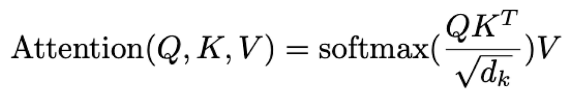

# Parallelizing Tree-Based Attention

**Authors:** gxt, minjeon2

---

## Summary

Our goal is to parallelize the core reduction step in self-attention using a tree-based reduction instead of a sequential loop, and compare its performance with a baseline sequential attention implementation.

---

## Background

The formula for calculating self-attention for some query *q* is as follows:

  

From the above equation, there are opportunities for parallelism: each CUDA thread can compute the input of the softmax function in parallel, then perform multiple reductions to compute the output of the softmax functions (calculate local denominator and numerator, then reduce across threads). In the paper, "Tree Attention: Topology-aware Decoding for Long-context Attention on GPU Clusters", Shyam et. al explains that these reductions are associative and thus can be computed using a parallel tree reduction. Thus, for our project, we will implement a parallel, tree-based reduction using CUDA for the logsumexp and value accumulation steps.

---

## The Challenge

* The attention calculation is known to be memory-bound. Thus, a kernel that simply calculates partials by repeatedly reading from global memory will be inefficient.
* After each thread block computes partial results (e.g. the local max, local numerator/denominator), we need to synchronize across thread blocks. The challenge is implementing the reduction step that combines all partial results from every thread block into the final softmax output.
* Tree-based algorithms on GPUs face issues regarding thread divergence and irregular memory accesses.

---

## Resources

We will start with a serial implementation in C++ to calculate the attention values, then use CUDA to accelerate the computation process. Furthermore, we will compare our implementations to existing methods of attention reductions that utilize various methods of parallelization (such as OpenMP). To understand the computation steps necessary for calculating the attention, we will refer to the standard formula for calculating attention shown in the Background section. Furthermore, our main approach of parallelizing the reduction will take inspiration from the paper, "Tree Attention: Topology-aware Decoding for Long-context Attention on GPU Clusters" by Vasudev Shyam et al., which we will be referencing throughout our implementation.

---

## Goals and Deliverables

**50%** - A correct, sequential C++ implementation of the tree attention algorithm and a basic benchmarking script to evaluate performance.

**75%** - A basic CUDA implementation that parallelizes the computation of the softmax input, and at least one reduction kernel for performing the softmax computation in parallel. We will also produce an analysis of this implementation to the baseline serial program.

**100%** - An optimized CUDA implementation for computing the softmax input in parallel, as well as all tree-based reduction kernels fully implemented. We will produce speedup graphs to compare with our baseline and perform detailed performance analysis of memory access efficiency and runtime scaling.

**125%** - Implement further GPU optimizations such as asynchronous pipelining of kernels to improve throughput and warp divergence-free techniques.

**150%** - Extend the implementation beyond CUDA by adding an additional parallelization strategy such as OpenMP or MPI, and analyze the benefits and drawbacks of each approach.

---

## Platform Choice

We will use the multi-core CPU (GHC machines) for our basic implementation, and test the scalability of our approach using the PSC machines.

---

## Schedule

1.  **Week 1 (11/17-11/23):** Complete serial implementation of attention computation and create at least one working kernel for reduction that produces **correct** results.
2.  **Week 2 (11/24-11/30):** Complete implementation of all tree-based kernels that produce correct final results, and measure speedup on GHC and PSC machines. Split up work between Sunny and Grace to write up portions of the midway report.
3.  **Midway Report Due 11/30**
4.  **Week 3 (12/01- 12/07):** Compare our approach with other existing methods and optimize our approach. Optimize our code (minimize accesses to memory, remove unnecessary redundant computations). Get final speedup and performance data by **12/05**.
5.  **Final Report Due 12/08**
